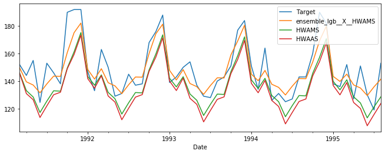
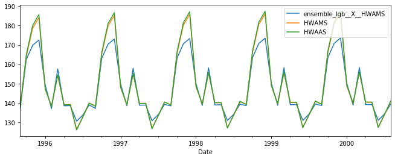

# Automated Time Series Models in Python (AtsPy)

Easily develop state of the art time series models to forecast univariate data series. Simply load your data and select which models you want to test. This is the largest repository of automated structural and machine learning time series models. Please get in contact if you want to contribute a model.  

#### Install
```
pip install atspy
```

#### Automated Models

1. ```ARIMA``` - Automated ARIMA Modelling
1. ```Prophet``` - Modeling Multiple Seasonality With Linear or Non-linear Growth
1. ```HWAAS``` - Exponential Smoothing With Additive Trend and Additive Seasonality
1. ```HWAMS``` - Exponential Smoothing with Additive Trend and Multiplicative Seasonality
1. ```PYAF``` - Feature Generating Model (slow and underforms)
1. ```NBEATS``` -  Neural basis expansion analysis (now fixed at 20 Epochs)
1. ```Gluonts``` - RNN-based Model (now fixed at 20 Epochs)
1. ```TATS``` - Seasonal and Trend no Box Cox
1. ```TBAT``` - Trend and Box Cox
1. ```TBATS1``` - Trend, Seasonal (one), and Box Cox
1. ```TBATP1``` - TBATS1 but Seasonal Inference is Hardcoded by Periodicity
1. ```TBATS2``` - TBATS1 With Two Seasonal Periods

#### Why AtsPy?

1. Implements all your favourite automated time series models in a unified manner by simply running ```AutomatedModel(df)```.
1. Reduce structural model errors with 30%-50% by using LightGBM with TSFresh infused features.  
1. Automatically identify the seasonalities in your data using singular spectrum analysis, periodograms, and peak analysis.
1. Identifies and makes accessible the best model for your time series using in-sample validation methods.  
1. Combines the predictions of all these models in a simple (average) and complex (GBM) ensembles for improved performance.
1. Where appropriate models have been developed to use GPU resources to speed up the automation process.
1. Easily access all the models by using ```am.models_dict_in``` for in-sample and ```am.models_dict_out``` for out-of-sample prediction.

#### AtsPy Progress 

1. Univariate forecasting only (single column) and only monthly and daily data have been testes for suitability.  
1. More work ahead; all suggestions and criticisms appreciated, use the issues tab.


### Documentation by Example

----------
#### Load Package
```python
from atspy import AutomatedModel
```

#### Pandas DataFrame

The data requires strict preprocessing, no periods can be skipped and there cannot be any empty values. 

```python
import pandas as pd
df = pd.read_csv("https://raw.githubusercontent.com/firmai/random-assets-two/master/ts/monthly-beer-australia.csv")
df.Month = pd.to_datetime(df.Month)
df = df.set_index("Month"); df
```
<table class="dataframe">
  <thead>
    <tr style="text-align: right;">
      <th></th>
      <th>Target</th>
      <th>HWAMS</th>
      <th>HWAAS</th>
      <th>TBAT</th>
    </tr>
    <tr>
      <th>Date</th>
      <th></th>
      <th></th>
      <th></th>
      <th></th>
    </tr>
  </thead>
  <tbody>
    <tr>
      <th>1985-10-01</th>
      <td>181.6</td>
      <td>161.962148</td>
      <td>162.391653</td>
      <td>148.410071</td>
    </tr>
    <tr>
      <th>1985-11-01</th>
      <td>182.0</td>
      <td>174.688055</td>
      <td>173.191756</td>
      <td>147.999237</td>
    </tr>
    <tr>
      <th>1985-12-01</th>
      <td>190.0</td>
      <td>189.728744</td>
      <td>187.649575</td>
      <td>147.589541</td>
    </tr>
    <tr>
      <th>1986-01-01</th>
      <td>161.2</td>
      <td>155.077205</td>
      <td>154.817215</td>
      <td>147.180980</td>
    </tr>
    <tr>
      <th>1986-02-01</th>
      <td>155.5</td>
      <td>148.054292</td>
      <td>147.477692</td>
      <td>146.773549</td>
    </tr>
  </tbody>
</table>


#### AtsPy AutomatedModel

1. ```AutomatedModel``` - Returns a class instance.
1. ```forecast_insample``` - Returns an in-sample forcasted dataframe and performance.  
1. ```forecast_outsample``` - Returns an out-of-sample forcasted dataframe.
1. ```ensemble``` - Returns the results of three different forms of ensembles.
1. ```models_dict_in``` - Returns a dictionary of the fully trained in-sample models.
1. ```models_dict_out``` - Returns a dictionary of the fully trained out-of-sample models.

```python
from atspy import AutomatedModel
model_list = ["HWAMS","HWAAS","TBAT"]
am = AutomatedModel(df = df , model_list=model_list,forecast_len=20 )
```

Other models to try, add as many as you like, note ```ARIMA``` is slow: ```"ARIMA","Gluonts","PYAF","Prophet","NBEATS", "TATS", "TBATS1", "TBATP1", "TBATS2"```

&nbsp;

#### In-Sample Performance
```python
forecast_in, performance = am.forecast_insample()
```

```python
performance
```

<table class="dataframe">
  <thead>
    <tr style="text-align: right;">
      <th></th>
      <th>Target</th>
      <th>HWAMS</th>
      <th>HWAAS</th>
      <th>TBAT</th>
    </tr>
  </thead>
  <tbody>
    <tr>
      <th>rmse</th>
      <td>0.000000</td>
      <td>17.599400</td>
      <td>18.993827</td>
      <td>36.538009</td>
    </tr>
    <tr>
      <th>mse</th>
      <td>0.000000</td>
      <td>309.738878</td>
      <td>360.765452</td>
      <td>1335.026136</td>
    </tr>
    <tr>
      <th>mean</th>
      <td>155.293277</td>
      <td>142.399639</td>
      <td>140.577496</td>
      <td>126.590412</td>
    </tr>
  </tbody>
</table>

&nbsp;

#### Out of Sample Forecast

```python
forecast_out = am.forecast_outsample(); forecast_out
```

<table class="dataframe">
  <thead>
    <tr style="text-align: right;">
      <th></th>
      <th>HWAMS</th>
      <th>HWAAS</th>
      <th>TBAT</th>
    </tr>
    <tr>
      <th>Date</th>
      <th></th>
      <th></th>
      <th></th>
    </tr>
  </thead>
  <tbody>
    <tr>
      <th>1995-09-01</th>
      <td>137.518755</td>
      <td>137.133938</td>
      <td>142.906275</td>
    </tr>
    <tr>
      <th>1995-10-01</th>
      <td>164.136220</td>
      <td>165.079612</td>
      <td>142.865575</td>
    </tr>
    <tr>
      <th>1995-11-01</th>
      <td>178.671684</td>
      <td>180.009560</td>
      <td>142.827110</td>
    </tr>
    <tr>
      <th>1995-12-01</th>
      <td>184.175954</td>
      <td>185.715043</td>
      <td>142.790757</td>
    </tr>
    <tr>
      <th>1996-01-01</th>
      <td>147.166448</td>
      <td>147.440026</td>
      <td>142.756399</td>
    </tr>
  </tbody>
</table>

&nbsp;

#### Ensemble and Second Model Validation Performance

```python
all_ensemble_in, all_ensemble_out, all_performance = am.ensemble(forecast_in, forecast_out)
```

```python
all_performance
```

<table class="dataframe">
  <thead>
    <tr style="text-align: right;">
      <th></th>
      <th>rmse</th>
      <th>mse</th>
      <th>mean</th>
    </tr>
  </thead>
  <tbody>
    <tr>
      <th>ensemble_lgb__X__HWAMS</th>
      <td>9.697588</td>
      <td>94.043213</td>
      <td>146.719412</td>
    </tr>
    <tr>
      <th>ensemble_lgb__X__HWAMS__X__HWAMS_HWAAS__X__ensemble_ts__X__HWAAS</th>
      <td>9.875212</td>
      <td>97.519817</td>
      <td>145.250837</td>
    </tr>
    <tr>
      <th>ensemble_lgb__X__HWAMS__X__HWAMS_HWAAS</th>
      <td>11.127326</td>
      <td>123.817378</td>
      <td>142.994374</td>
    </tr>
    <tr>
      <th>ensemble_lgb</th>
      <td>12.748526</td>
      <td>162.524907</td>
      <td>156.487208</td>
    </tr>
    <tr>
      <th>ensemble_lgb__X__HWAMS__X__HWAMS_HWAAS__X__ensemble_ts__X__HWAAS__X__HWAMS_HWAAS_TBAT__X__TBAT</th>
      <td>14.589155</td>
      <td>212.843442</td>
      <td>138.615567</td>
    </tr>
    <tr>
      <th>HWAMS</th>
      <td>15.567905</td>
      <td>242.359663</td>
      <td>136.951615</td>
    </tr>
    <tr>
      <th>HWAMS_HWAAS</th>
      <td>16.651370</td>
      <td>277.268110</td>
      <td>135.544299</td>
    </tr>
    <tr>
      <th>ensemble_ts</th>
      <td>17.255107</td>
      <td>297.738716</td>
      <td>163.134079</td>
    </tr>
    <tr>
      <th>HWAAS</th>
      <td>17.804066</td>
      <td>316.984751</td>
      <td>134.136983</td>
    </tr>
    <tr>
      <th>HWAMS_HWAAS_TBAT</th>
      <td>23.358758</td>
      <td>545.631579</td>
      <td>128.785846</td>
    </tr>
    <tr>
      <th>TBAT</th>
      <td>39.003864</td>
      <td>1521.301380</td>
      <td>115.268940</td>
    </tr>
  </tbody>
</table>

&nbsp;

#### Best Performing In-sample

```python
all_ensemble_in[["Target","ensemble_lgb__X__HWAMS","HWAMS","HWAAS"]].plot()
```


&nbsp;

#### Future Prediction

```python
all_ensemble_out[["ensemble_lgb__X__HWAMS","HWAMS","HWAAS"]].plot()
```



#### AtsPy Future Development

1. Additional in-sample validation steps to stop deep learning models from over and underfitting. 
1. Code annotations for other developers to follow and improve on the work being done. 
1. Force seasonality stability between in and out of sample training models.
1. Make AtsPy less dependency heavy, currently it draws on tensorflow, pytorch and mxnet. 


